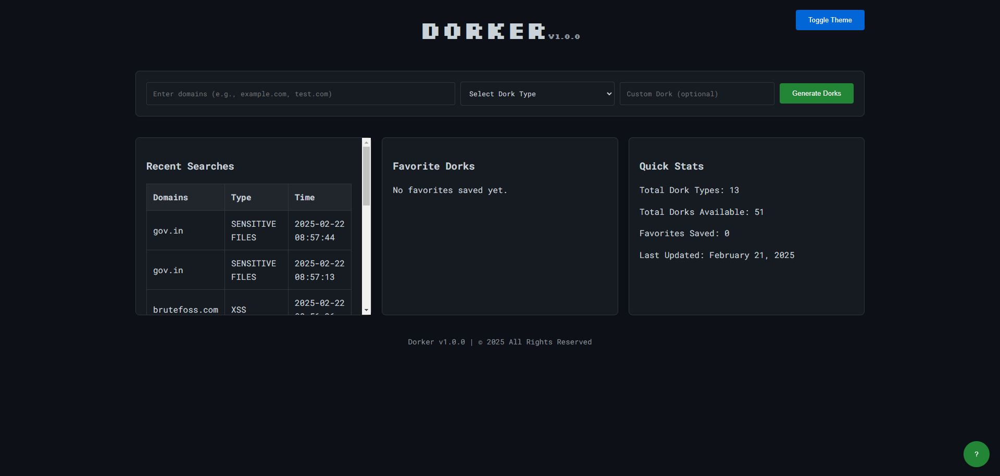
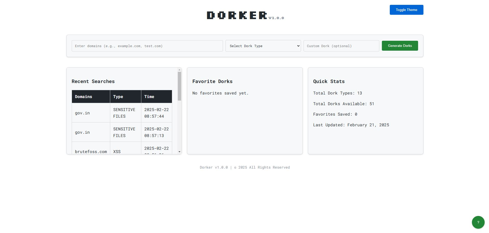

Dorker is a powerful, web-based Google Dorks generator built with PHP, designed to help security researchers, penetration testers, and enthusiasts create custom search queries for discovering vulnerabilities and exposed information on websites. With an intuitive interface and advanced features, Dorker simplifies the process of generating dorks for various types of security testing.




## Features
* Multiple Dork Types: Predefined dorks for XSS, SQLi, LFI, RCE, SSRF, XXE, and more.
* Multi-Domain Support: Generate dorks for multiple domains in a single query (comma-separated).
* Custom Dorks: Input your own dork syntax with basic validation.
* Favorites: Save and load your favorite dork sets.
* Recent Searches: Track your last 10 searches with timestamps.
* Export Options: Export dorks as TXT or CSV files.
* Live Result Count: See approximate Google result counts for each dork (requires API).
* Preview Results: View top 5 Google search results per dork (requires API).
* Theme Switcher: Toggle between dark and light themes with persistent settings.
* Responsive Design: Works seamlessly on desktop and mobile devices.

## Installation
### Prerequisites
* PHP: Version 7.x or 8.x
* Web Server: Apache, Nginx, or similar (e.g., XAMPP, WAMP)
* Google Custom Search API: Optional, for live result counts and previews (see API Setup)

### Steps
1. Clone the Repository:

    ```bash
    git clone https://github.com/iampritam97/dorker.git
    cd dorker
    ```
2. Set Up Files:
    * Copy `index.php` and `remove_favorite.php` to your web server’s root directory (e.g., `C:\xampp\htdocs\dorker`).
    * Create a file named `recent_searches.json` in the same directory with initial content: `[]`.

3. Configure Permissions:
Ensure `recent_searches.json` is writable by the web server:
    * On Windows (XAMPP), ensure the file is not read-only.
    ```bash
    chmod 664 recent_searches.json  # On Linux/Unix
    ```


4. Start Your Server:
    * If using XAMPP, start Apache via the XAMPP Control Panel.
    * For other setups, configure your web server to serve the `dorker` directory.
5. Access the App:
    * Open your browser and navigate to `http://localhost/dorker/index.php`.

### Google Custom Search API Setup
To enable live result counts and dork previews:

1. Get an API Key:
    * Go to [Google Cloud Console](https://console.cloud.google.com/).
    * Create a project and enable the "Custom Search API".
    * Generate an API key under "Credentials".
2. Create a Custom Search Engine:
    * Visit [Google CSE](https://cse.google.com/cse/).
    * Create a new search engine, enabling "Search the entire web" and disabling "SafeSearch".
    * Get the "Search engine ID" (CX ID).
3. Update the Code:
    * Open `index.php` and replace with your API key and CX ID.:
    ```php
    $api_key = "YOUR_GOOGLE_API_KEY";
    $cx = "YOUR_CX_ID";
    ```
4. Quota Note:
    * The free tier provides 100 queries/day. For heavy use, consider a paid plan or disable API features by removing the `window.onload` and `previewDork` functions.

## Usage
1. Generate Dorks:
    * Enter one or more domains (e.g., `example.com, test.com`) in the "Domains" field.
    * Select a dork type from the dropdown or enter a custom dork.
    * Click "Generate Dorks" to see the results.
2. Interact with Results:
    * Click a dork link to search Google.
    * Use "Copy" to copy a dork to your clipboard.
    * Click "Preview" to see top 5 results (if API is set up).
    * Export results as TXT or CSV using the buttons.
3. Manage Favorites:
    * Save a dork set as a favorite with "Save as Favorite".
    * Load or remove favorites from the "Favorite Dorks" section.
4. Switch Themes:
    * Click "Toggle Theme" in the header to switch between dark and light modes.

## Ideas for Contributions
* Add new dork types to the $dorks array.
* Enhance UI or additional themes.
* Integrate more search engines (e.g., Bing, DuckDuckGo).
* Implement user authentication with a database. (Not priority)

## License
This project is licensed under the [MIT License](https://grok.com/chat/LICENSE). Feel free to use, modify, and distribute it as you see fit.

## Acknowledgments
* Built with PHP, HTML, CSS, and JavaScript.
* Uses [Clipboard.js](https://clipboardjs.com/) for copy functionality.
* Inspired by the need for an easy-to-use dork generator for security testing.